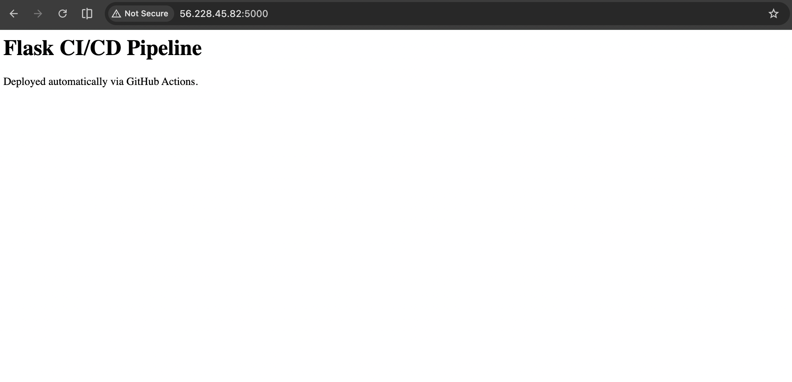
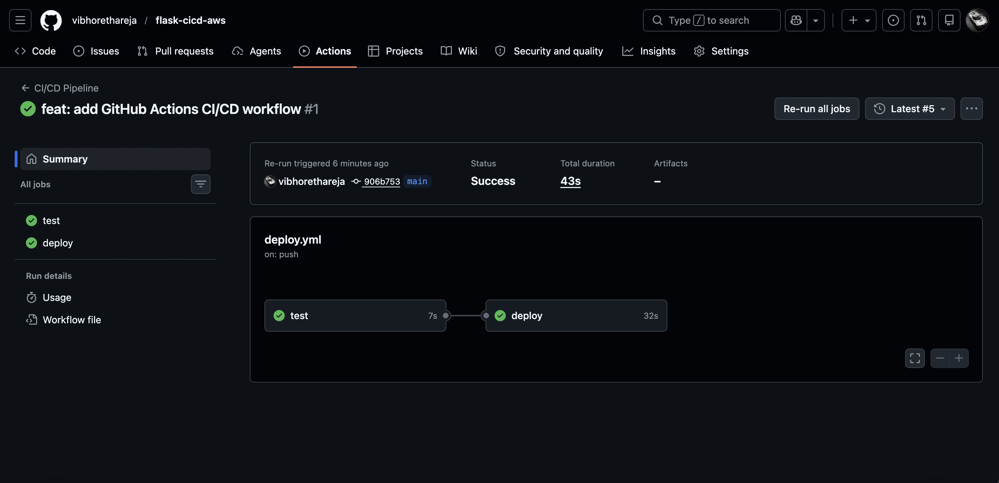
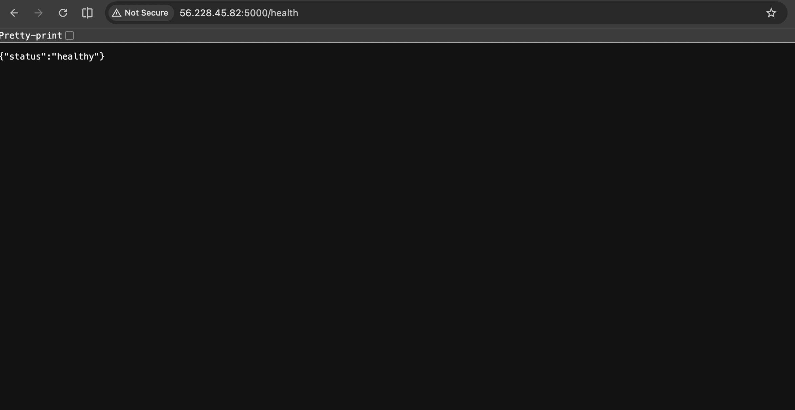

# Flask CI/CD Pipeline on AWS EC2

Automated CI/CD pipeline that deploys a Python Flask application 
to AWS EC2 every time code is pushed to GitHub.

## Architecture

Developer → GitHub Push → GitHub Actions → EC2 (Docker)
|
Run Tests → Build Image → Deploy Container

## Tech Stack

- **App:** Python Flask
- **Containerization:** Docker
- **CI/CD:** GitHub Actions
- **Cloud:** AWS EC2 (Ubuntu 22.04, eu-north-1)
- **Networking:** AWS Security Groups, Elastic IP

## Features

- Automated testing on every push (pytest)
- Docker containerization for consistent environments
- Zero-downtime redeployment via container restart
- Health check endpoint at `/health`
- Static Elastic IP for stable access

## Pipeline Flow

1. Developer pushes code to `main` branch
2. GitHub Actions triggers automatically
3. Tests run via pytest — deploy only proceeds if tests pass
4. SSH into EC2, pull latest code
5. Build new Docker image
6. Stop old container, start new one on port 5000

## Live Demo

App URL: http://56.228.45.82:5000
Health Check: http://56.228.45.82:5000/health

## Screenshots

### Live Application


### GitHub Actions Pipeline


### Health Endpoint


## Local Setup

```bash
# Clone the repo
git clone https://github.com/vibhorethareja/flask-cicd-aws.git
cd flask-cicd-aws

# Build Docker image
docker build -t flask-cicd-app .

# Run locally
docker run -p 5001:5000 flask-cicd-app

# Run tests
pip install -r requirements.txt
pytest tests/
```

## Key Learnings

- Configured GitHub Actions workflow with separate test and deploy jobs
- Used GitHub Secrets to securely store EC2 credentials
- Implemented Docker containerization for environment consistency
- Assigned Elastic IP for stable EC2 access
- Configured AWS Security Groups for controlled access